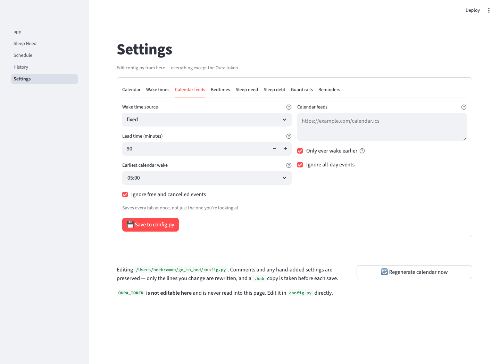

# go_to_bed

Work out when *you* should go to bed and when to get up, from your own Oura Ring
history — as an `.ics` calendar you can subscribe to, and a Streamlit app that
shows the reasoning.

Oura's own `sleep_time` endpoint is not much help here: it returns
`optimal_bedtime: null` with status `only_recommended_found` on most days. This
derives the recommendation from the nights you actually slept well instead.


## Features

- 🛏️ **Personal sleep need** — the median time you actually slept on nights that
  scored well, not a generic eight hours
- ⏰ **Wake times per day** — Monday–Friday, Saturday and Sunday configured
  separately so a late Sunday start never drags your weekday bedtime with it,
  plus an optional override for any individual weekday
- 🛌 **Fixed bedtimes, optionally** — prefer a set routine to a computed one?
  Configure bedtimes the same way, per day, and the app still tells you whether
  that time actually covers your sleep need
- 📉 **Sleep debt** — shortfalls over a rolling window pull your bedtime earlier,
  spread across several nights and capped, so recovery never demands one brutal
  early night
- 🎯 **Efficiency-aware** — the target is *time in bed*, not time asleep: your
  sleep need divided by your median efficiency, which folds in how long you take
  to fall asleep and how long you're awake mid-night
- 🚧 **Guard rails** — the recommendation is held inside a configured window, so
  a bad fortnight can't suggest a 19:00 bedtime
- 📅 **Calendar output** — `bedtime.ics` with "Go to bed" and "Wake up" events
  and alarms, ready for Google Calendar, Apple Calendar or Outlook
- 🔔 **Stacked reminders** — set one lead time or several, so you get an hour's
  warning and then a final nudge at fifteen minutes
- 📊 **Streamlit app** — tonight's plan, how your sleep need was derived, the
  nights ahead, and how each past night landed
- ⚙️ **Settings page** — edit every setting from the browser and write it back to
  `config.py`, comments intact. The Oura token is never shown or written there
- 📆 **Calendar-aware** — point it at one or more `.ics` feeds and an early
  first commitment pulls your alarm, and with it that night's bedtime, earlier.
  A *late* first event never makes you sleep in
- 🔌 **Pluggable wake times** — `WAKE_SOURCE` selects where wake times come from
- 🔁 **Self-updating config** — a run adds any setting `config.py.template` has
  that your `config.py` lacks, with its comment and in the right section. Your
  values are never touched, so upgrading is just `git pull`
- Degrades gracefully: API errors print a message and return empty rather than
  raising, and a thin history falls back to a configured default

## Requirements

- Python 3.9+
- Oura API token with `sleep` and `daily` scopes
- Dependencies:
  - `requests`, `icalendar` — for the CLI
  - `streamlit`, `pandas`, `altair` — for the UI

## Setup

1. Clone the repo:
   ```bash
   git clone https://github.com/ramhee98/go_to_bed.git
   cd go_to_bed
   ```

2. Run the installer, which creates the virtual environment, installs the
   dependencies and copies the config template:
   ```bash
   bash install.sh
   ```

   Or by hand:
   ```bash
   python3 -m venv .venv
   source .venv/bin/activate
   pip install -r requirements.txt
   cp config.py.template config.py
   ```

3. Edit `config.py`: set `OURA_TOKEN` and your wake times.

### Reminders

`BED_ALARM_MINUTES_BEFORE` and `WAKE_ALARM_MINUTES_BEFORE` accept several forms:

```python
BED_ALARM_MINUTES_BEFORE = (60, 15)    # two reminders: 1 hour, then 15 minutes
BED_ALARM_MINUTES_BEFORE = 15          # a single reminder
BED_ALARM_MINUTES_BEFORE = "60,15"     # comma-separated string
BED_ALARM_MINUTES_BEFORE = None        # no alarm

WAKE_ALARM_MINUTES_BEFORE = 0          # exactly at the wake time
```

Each lead time becomes its own `VALARM`, worded so stacked reminders aren't
identical — "Bedtime in 1 hour", then "Bedtime in 15 min". Values are
de-duplicated and ordered furthest-out first; anything unreadable is dropped
with a warning rather than stopping the run.

### Calendar-driven wake times

Set `WAKE_SOURCE = "calendar"` to read your actual commitments:

```python
WAKE_SOURCE = "calendar"

CALENDAR_URLS = [
    "https://example.com/work.ics",
    "https://example.com/lectures.ics",
    "/var/www/html/personal.ics",      # local paths work too
]

CALENDAR_LEAD_MINUTES  = 90        # getting ready + travel
CALENDAR_ONLY_EARLIER  = True      # a late meeting is no reason to sleep in
CALENDAR_EARLIEST_WAKE = "05:00"   # floor, whatever the calendar says
CALENDAR_SKIP_ALL_DAY  = True
CALENDAR_SKIP_FREE     = True
```

Each day, the earliest qualifying event sets `wake = first event − lead time`.
That flows through the sleep model, so an 08:15 lecture doesn't just move your
alarm — it moves the previous night's bedtime too.

**It only ever moves the alarm earlier.** With `CALENDAR_ONLY_EARLIER` on, a day
whose first event is at 14:00 keeps your configured wake time; only a morning
starting earlier than usual pulls it forward. Turn it off to follow the calendar
in both directions.

What it deliberately ignores:

| Skipped | Why |
|---|---|
| All-day events | A birthday or holiday doesn't start your morning |
| `TRANSP:TRANSPARENT` | Marked free, so not a commitment |
| `STATUS:CANCELLED` | It isn't happening |
| Anything before `CALENDAR_EARLIEST_WAKE` | A stray 03:00 entry shouldn't demand a 01:30 start |
| Zero-length events (`CALENDAR_SKIP_ZERO_LENGTH`) | Point-in-time reminders like "pay rent" |
| Events shorter than `CALENDAR_MIN_EVENT_MINUTES` | A 15-minute standup rarely justifies an early night |
| Titles matching `CALENDAR_IGNORE_SUMMARIES` | The recurring entries you don't actually attend |

Filtering by title:

```python
CALENDAR_MIN_EVENT_MINUTES = 30      # 0 disables

CALENDAR_IGNORE_SUMMARIES = [
    "lunch",        # matches anywhere: catches "Team Lunch"
    "daily*",       # contains * -> matches the whole title
    "OOO*",
]
```

Matching is case-insensitive. A plain word matches anywhere in the title; a
pattern containing `*` or `?` is matched against the whole title, so
`"standup*"` catches "Standup — backend" but not "Daily standup" (use
`"*standup*"` for that). An event whose length the feed doesn't state is always
kept — dropping what can't be measured risks oversleeping, while keeping it only
risks a needlessly early night.

A timed event with neither `DTEND` nor `DURATION` is **zero-length**, not
unknown: RFC 5545 says it ends at its start. Those are the point-in-time
reminders calendars accumulate, and `CALENDAR_SKIP_ZERO_LENGTH` (on by default)
drops them. Genuinely undeterminable lengths — a malformed event pairing a
timestamp with a date — are the ones that get kept.

Recurring events are expanded (`RRULE`), including `EXDATE` cancellations, so a
weekly lecture sets the alarm every week rather than only on its first date.

Feeds are read once per run. A feed that is unreachable, malformed or empty logs
a warning and that day falls back to your configured wake time — a calendar
being down never stops the run.

### Bedtimes

By default the bedtime is computed. To keep a fixed routine instead, set
`BED_SOURCE = "fixed"` and configure it exactly like the wake times:

```python
BED_SOURCE = "fixed"

BED_TIME_WEEKDAY  = "23:00"   # any Mon-Fri night not overridden below
BED_TIME_SATURDAY = "23:30"
BED_TIME_SUNDAY   = "22:30"

BED_TIME_FRIDAY   = "00:30"   # optional per-day override
BED_TIME_MONDAY   = None      # None -> uses BED_TIME_WEEKDAY
```

**The day names the evening you turn in**, not the morning you get up:
`BED_TIME_MONDAY` is Monday night, pairing with Tuesday's wake time. A time
before noon is read as the small hours of the next morning, so `"00:30"` on
Friday means half past midnight on Saturday.

A fixed bedtime is a decision rather than a suggestion, so neither the sleep
debt adjustment nor the `EARLIEST_BEDTIME` / `LATEST_BEDTIME` guard rails move
it. Your sleep need is still computed, and the calendar event says how the fixed
time compares:

```
⚠️ Fixed bedtime gives 7:20 in bed, 0:38 short of your 7:58 target.
```

### Wake times

Wake times resolve in three layers, most specific first:

```python
WAKE_TIME_WEEKDAY  = "06:30"   # any Mon-Fri not overridden below
WAKE_TIME_SATURDAY = "08:00"
WAKE_TIME_SUNDAY   = "08:00"

WAKE_TIME_WEDNESDAY = "09:45"  # optional per-day override
WAKE_TIME_FRIDAY    = "05:30"
WAKE_TIME_MONDAY    = None     # None -> uses WAKE_TIME_WEEKDAY
```

A per-day override wins over the weekday default; Saturday and Sunday are set by
their own lines. A day left as `None`, or a time that can't be parsed, falls
through to the layer below with a warning rather than stopping the run.

## Usage

Generate the calendar:

```bash
python3 main.py
```

```
Fetching sleep history for the past 90 days...
Learning your personal sleep need...
  Sleep need: 7:29 (personal, from 34/80 nights)
  Efficiency: 94% → 7:58 in bed
  Sleep debt: 7:46 over the last 14 days
Planning the next 14 nights...

  🛏️  Tonight: bed at 21:46, up at 06:30 (8:44 in bed)

Loading existing calendar...
Added 28 planned event(s) for 14 night(s).
Saving calendar to ./bedtime.ics...
Done.
```

Then subscribe to `bedtime.ics` from your calendar client so the reminder
reaches your phone. Re-running is safe: plans for days in the planning window
are replaced, and plans for days already past are kept as a record of what was
recommended at the time.

Explore the reasoning:

```bash
streamlit run app.py
```

Run the tests:

```bash
python3 tests/test_model.py     # or: pytest
```

## How the bedtime is calculated

1. **Sleep need** — the median time asleep on nights scoring `GOOD_SLEEP_SCORE`
   or better. Naps are excluded; only Oura's `long_sleep` counts. If fewer than
   `MIN_GOOD_NIGHTS` clear that bar, your own top quartile is used instead, and
   only if that still isn't enough does `FALLBACK_SLEEP_NEED_HOURS` apply.
2. **Time in bed** — sleep need ÷ median efficiency.
   Skipped entirely when `BED_SOURCE = "fixed"`.
3. **Sleep debt** — shortfalls (never surpluses) over `DEBT_WINDOW_DAYS`, divided
   by `DEBT_RECOVERY_NIGHTS` and capped at `MAX_DEBT_ADJUSTMENT_MINUTES`.
   See [Sleep debt](#sleep-debt) below.
4. **Bedtime** — wake time − time in bed − debt adjustment, held between
   `EARLIEST_BEDTIME` and `LATEST_BEDTIME`.

### Sleep debt

`DEBT_SOURCE` picks where the adjustment comes from:

| Source | Basis | Tonight, on the account this was built against |
|---|---|---|
| `"oura"` (default) | Oura's own decay-weighted formula | debt 0:10 → 1m earlier |
| `"computed"` | Only your shortfalls, undecayed | debt 7:46 → capped at 60m earlier |
| `"oura_balance"` | Oura's `sleep_balance` readiness contributor | balance 86/100 → 8m earlier |
| `"none"` | No adjustment at all | — |

#### The Oura formula

```
L_n = sleep_need - time_slept        (for the night n days ago, signed)
D   = L_0 + L_1(0.93) + L_2(0.93)² + … + L_13(0.93)¹³
D   = max(D, 0), rounded to the nearest 10 minutes
```

Nights with no data are skipped rather than counted as zero sleep.

**Surpluses offset deficits.** `L` is signed and only the total is clamped, so
a long night genuinely repays an earlier short one. This was checked against
eight figures read from the Oura app, spanning debts from 10 minutes to 7 hours:
clamping each night at zero instead overshot by 130-250 minutes on every single
one. It is the behaviour that makes the formula work.

Validated against those eight observations with `OURA_BASELINE_NEED_HOURS =
7.217`: **total error 70 minutes across all eight**, four of them exact, most of
the rest within one rounding step.

| Day | Oura app | This app |
|---|---|---|
| 1 Sept | 420 | 410 |
| 3 Sept | 320 | **320** |
| 4 Sept | 300 | **300** |
| 12 Sept | 30 | **30** |
| 14 Sept | 10 | **10** |

**A caveat on the Oura source.** Oura does not publish a sleep debt duration —
`sleep_time` returns `optimal_bedtime: null` on most days, and nothing in the v2
API gives hours owed. `sleep_balance` is a **0-100 score** covering roughly the
last two weeks, so the mapping to minutes is this app's, not Oura's:

```
adjustment = (100 - sleep_balance) / 100 × MAX_DEBT_ADJUSTMENT_MINUTES
```

A balance of 100 asks for nothing; 50 asks for half the configured maximum. It
is markedly gentler than the computed figure, because it reflects Oura's view of
balance rather than a literal tally of hours missed.

#### Matching Oura's own sleep need

The `"oura"` source measures against a baseline sleep need, and Oura publishes
neither its debt figure nor the need behind it. The result is extremely
sensitive to that baseline — the 14-day weights sum to about 9.1, so **every
minute of baseline error moves the debt by roughly nine minutes.**

Read today's debt off the Oura app and invert the formula for it:

```bash
python3 main.py --calibrate-debt 10          # today's figure
python3 main.py --calibrate-debt 10,20,30    # today, yesterday, the day before
```

```
  Baseline that reproduces it: 7:12 (7.210 hours, naps excluded)
  Fit against each observation:
    2026-09-14  model   0m   app  10m   off -10
    2026-09-13  model  30m   app  20m   off +10
    2026-09-12  model  20m   app  30m   off -10
```

Put the result in `OURA_BASELINE_NEED_HOURS`. `OURA_DEBT_INCLUDE_NAPS` controls
whether naps count toward each day's total; nights-only has fitted better in
testing, so it defaults off.

**Calibrate rather than reading the need off the app.** The need Oura displays
(7:16 on this account) is about three minutes above the one that reproduces its
debt figures (7:13) — and at ninefold amplification, three minutes is ~27
minutes of debt. Using the displayed value gave a total error of 210 minutes
across the eight observations; the calibrated value gives 70.

An exact match every day should not be expected: the app rounds to 10 minutes,
its sleep need drifts by a minute or two day to day, and the amplification turns
either into a visible difference.

The Oura app shows a sleep debt in minutes, but **no v2 endpoint exposes that
number** — it is computed in the app. So when `DEBT_SOURCE = "oura"` the
shortfall tally is still computed here and shown beside the score, giving you a
duration to read even though the adjustment comes from the balance:

```
Sleep debt  7:46
Oura balance 86/100 → -0:08
```

#### The computed source

For every night inside `DEBT_WINDOW_DAYS`:

```
shortfall = sleep_need - time_asleep
if shortfall > 0:  debt += shortfall
```

Then, per planned night:

```
adjustment = min(debt / DEBT_RECOVERY_NIGHTS, MAX_DEBT_ADJUSTMENT_MINUTES)
```

**Only deficits count.** A night longer than your sleep need adds nothing — the
surplus is discarded rather than credited, so a long Saturday does not repay a
short Tuesday. Naps are excluded here too; only Oura's `long_sleep` counts.

**Debt is repaid gradually.** Dividing by `DEBT_RECOVERY_NIGHTS` and capping the
result keeps a bad fortnight from demanding one punishing early night.

Two behaviours worth knowing:

- The figure is computed once from history and applied to **every** night in the
  plan. It does not simulate paying itself down as you follow the schedule, so
  the whole window gets the same adjustment.
- Because `sleep_need` comes from your *good* nights, the bar sits above a
  typical night. If most of your nights fall short, the cap does the work rather
  than the arithmetic — raise `MAX_DEBT_ADJUSTMENT_MINUTES` if you want the full
  correction.

## Keeping config.py up to date

`config.py` is created once from `config.py.template` and then drifts as the app
gains settings. Each run tops it up:

```
Added 1 new setting(s) from config.py.template: AUTO_ADD_MISSING_SETTINGS
   Previous version kept at /path/to/config.py.bak
```

Only **missing** keys are added — your values, your comments and any settings
you added yourself are left alone. Each addition arrives with the comment that
documents it in the template, placed in the same section rather than appended to
the bottom, so the file stays readable rather than growing a junk drawer.

The `.bak` is written only when something is actually added, so ordinary runs
don't churn. Set `AUTO_ADD_MISSING_SETTINGS = False` to manage `config.py`
entirely by hand; a missing or unreadable template is a no-op either way, so the
sync can never block a run.

## Pages

### Sleep need

How much sleep you need, and the nights that show it. The dose-response curve
between time asleep and sleep score is usually clearer than expected.


### Schedule

Every planned night from lights-out to alarm, with the weekend shift visible at
a glance, plus a download for the `.ics`.


### History

How each night landed against your sleep need, and where the debt came from.


### Settings

Every setting except the token, written straight back to `config.py`.



Edits are surgical: only the lines you actually change are rewritten, so
comments, ordering and any settings you added by hand survive. A `config.py.bak`
copy is taken before each save, and the file is replaced atomically so an
interrupted write can't leave a broken config.

`OURA_TOKEN` is excluded by design — it is never read into the page and the
writer refuses it outright. Values are validated and re-serialised as typed
literals rather than pasted as text, so nothing typed into a form can execute
when `config.py` is next imported.

## Adding another wake-time source

`WAKE_SOURCE` picks where wake times come from — `"fixed"` and `"calendar"` ship
with the app. To add another (a shift roster, a travel itinerary):

1. Write a `WakeSchedule` subclass with `wake_time_for(day)` and `describe(day)`.
   Return `None` for days it has no opinion about, or delegate to
   `FixedWakeSchedule` to fall back to the configured time.
2. Register it in `SOURCES` in `wake/__init__.py`.
3. Add its settings to `config.py.template`.

Nothing else changes — `main.py`, the model and the Streamlit pages all talk to
the `WakeSchedule` interface, not to any particular source. `wake/calendar.py`
is the worked example.

## Example calendar output

**Title:**
```
🛏️ Go to bed (8:44 in bed)
```

**Description:**
```
Bedtime: 21:46
Wake up: 06:30
Time in bed: 8:44
Sleep need: 7:29
Efficiency: 94%
Typical latency: 0:08
Sleep debt adjustment: -0:45

Fixed weekday wake time (06:30).
Sleep need 7:29 at 94% efficiency → 7:58 in bed.
Sleep debt 7:46 → capped at 45m earlier.
Learned from 34 good nights of 80 analysed.
```

## Related

- [oura-sleep-ical](https://github.com/ramhee98/oura-sleep-ical) — your actual
  sleep, as a calendar
- [oura-tags-ical](https://github.com/ramhee98/oura-tags-ical) — your Oura tags,
  as a calendar
- [iCalSyncHub](https://github.com/ramhee98/iCalSyncHub) — sync and serve the
  generated `.ics` files

## License

MIT — see [LICENSE](LICENSE).
