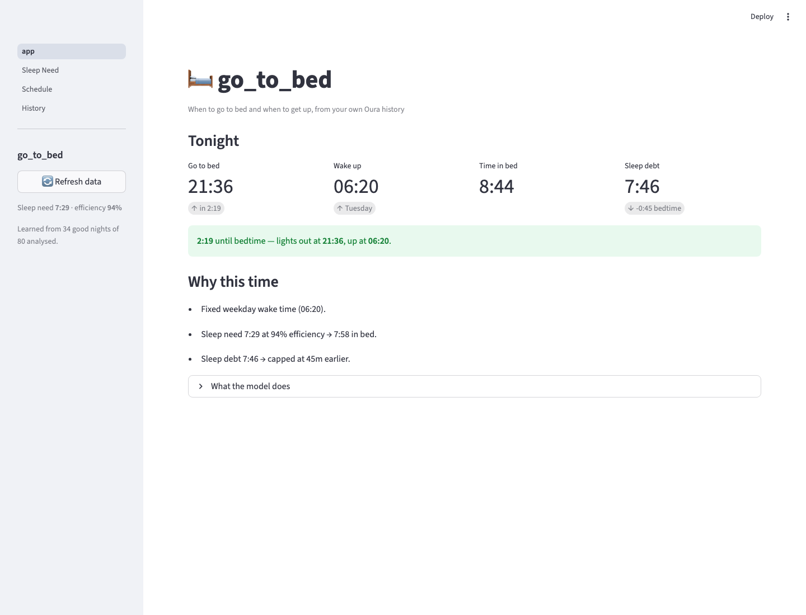
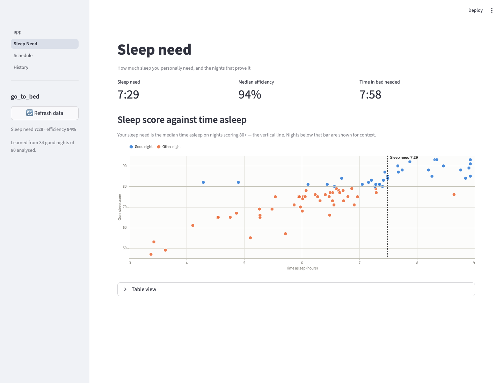
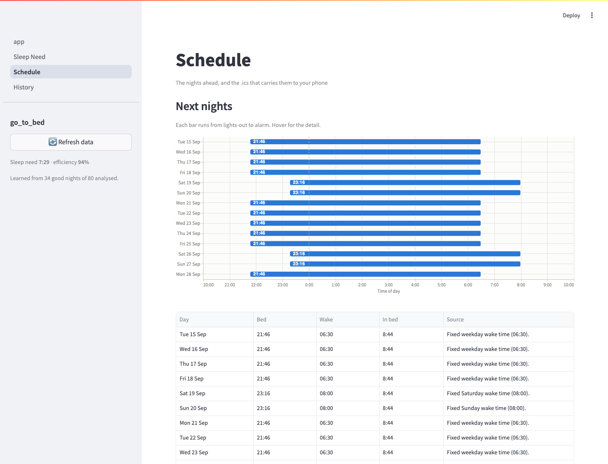
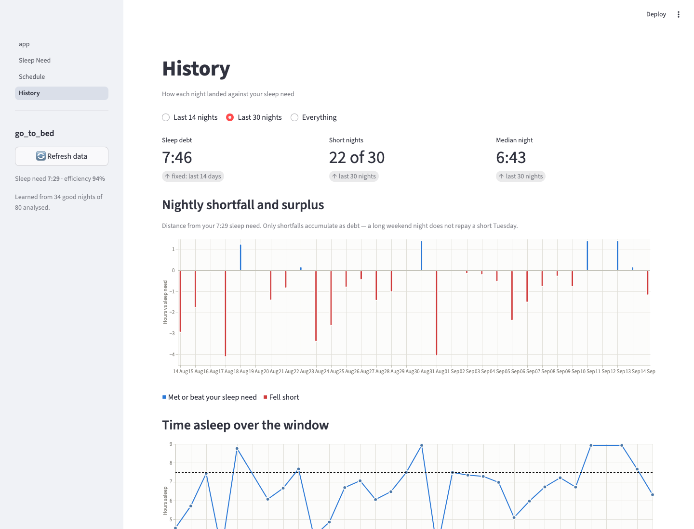

# go_to_bed

Work out when *you* should go to bed and when to get up, from your own Oura Ring
history — as an `.ics` calendar you can subscribe to, and a Streamlit app that
shows the reasoning.

Oura's own `sleep_time` endpoint is not much help here: it returns
`optimal_bedtime: null` with status `only_recommended_found` on most days. This
derives the recommendation from the nights you actually slept well instead.



## Features

- 🛏️ **Personal sleep need** — the median time you actually slept on nights that
  scored well, not a generic eight hours
- ⏰ **Wake times per day** — Monday–Friday, Saturday and Sunday configured
  separately so a late Sunday start never drags your weekday bedtime with it,
  plus an optional override for any individual weekday
- 📉 **Sleep debt** — shortfalls over a rolling window pull your bedtime earlier,
  spread across several nights and capped, so recovery never demands one brutal
  early night
- 🎯 **Efficiency-aware** — the target is *time in bed*, not time asleep: your
  sleep need divided by your median efficiency, which folds in how long you take
  to fall asleep and how long you're awake mid-night
- 🚧 **Guard rails** — the recommendation is held inside a configured window, so
  a bad fortnight can't suggest a 19:00 bedtime
- 📅 **Calendar output** — `bedtime.ics` with "Go to bed" and "Wake up" events
  and alarms, ready for Google Calendar, Apple Calendar or Outlook
- 🔔 **Stacked reminders** — set one lead time or several, so you get an hour's
  warning and then a final nudge at fifteen minutes
- 📊 **Streamlit app** — tonight's plan, how your sleep need was derived, the
  nights ahead, and how each past night landed
- 🔌 **Pluggable wake times** — `WAKE_SOURCE` selects where wake times come from;
  a calendar-driven source drops in without touching the model
- Degrades gracefully: API errors print a message and return empty rather than
  raising, and a thin history falls back to a configured default

## Requirements

- Python 3.9+
- Oura API token with `sleep` and `daily` scopes
- Dependencies:
  - `requests`, `icalendar` — for the CLI
  - `streamlit`, `pandas`, `altair` — for the UI

## Setup

1. Clone the repo:
   ```bash
   git clone https://github.com/ramhee98/go_to_bed.git
   cd go_to_bed
   ```

2. Run the installer, which creates the virtual environment, installs the
   dependencies and copies the config template:
   ```bash
   bash install.sh
   ```

   Or by hand:
   ```bash
   python3 -m venv .venv
   source .venv/bin/activate
   pip install -r requirements.txt
   cp config.py.template config.py
   ```

3. Edit `config.py`: set `OURA_TOKEN` and your wake times.

### Reminders

`BED_ALARM_MINUTES_BEFORE` and `WAKE_ALARM_MINUTES_BEFORE` accept several forms:

```python
BED_ALARM_MINUTES_BEFORE = (60, 15)    # two reminders: 1 hour, then 15 minutes
BED_ALARM_MINUTES_BEFORE = 15          # a single reminder
BED_ALARM_MINUTES_BEFORE = "60,15"     # comma-separated string
BED_ALARM_MINUTES_BEFORE = None        # no alarm

WAKE_ALARM_MINUTES_BEFORE = 0          # exactly at the wake time
```

Each lead time becomes its own `VALARM`, worded so stacked reminders aren't
identical — "Bedtime in 1 hour", then "Bedtime in 15 min". Values are
de-duplicated and ordered furthest-out first; anything unreadable is dropped
with a warning rather than stopping the run.

### Wake times

Wake times resolve in three layers, most specific first:

```python
WAKE_TIME_WEEKDAY  = "06:30"   # any Mon-Fri not overridden below
WAKE_TIME_SATURDAY = "08:00"
WAKE_TIME_SUNDAY   = "08:00"

WAKE_TIME_WEDNESDAY = "09:45"  # optional per-day override
WAKE_TIME_FRIDAY    = "05:30"
WAKE_TIME_MONDAY    = None     # None -> uses WAKE_TIME_WEEKDAY
```

A per-day override wins over the weekday default; Saturday and Sunday are set by
their own lines. A day left as `None`, or a time that can't be parsed, falls
through to the layer below with a warning rather than stopping the run.

## Usage

Generate the calendar:

```bash
python3 main.py
```

```
Fetching sleep history for the past 90 days...
Learning your personal sleep need...
  Sleep need: 7:29 (personal, from 34/80 nights)
  Efficiency: 94% → 7:58 in bed
  Sleep debt: 7:46 over the last 14 days
Planning the next 14 nights...

  🛏️  Tonight: bed at 21:46, up at 06:30 (8:44 in bed)

Loading existing calendar...
Added 28 planned event(s) for 14 night(s).
Saving calendar to ./bedtime.ics...
Done.
```

Then subscribe to `bedtime.ics` from your calendar client so the reminder
reaches your phone. Re-running is safe: plans for days in the planning window
are replaced, and plans for days already past are kept as a record of what was
recommended at the time.

Explore the reasoning:

```bash
streamlit run app.py
```

Run the tests:

```bash
python3 tests/test_model.py     # or: pytest
```

## How the bedtime is calculated

1. **Sleep need** — the median time asleep on nights scoring `GOOD_SLEEP_SCORE`
   or better. Naps are excluded; only Oura's `long_sleep` counts. If fewer than
   `MIN_GOOD_NIGHTS` clear that bar, your own top quartile is used instead, and
   only if that still isn't enough does `FALLBACK_SLEEP_NEED_HOURS` apply.
2. **Time in bed** — sleep need ÷ median efficiency.
3. **Sleep debt** — shortfalls (never surpluses) over `DEBT_WINDOW_DAYS`, divided
   by `DEBT_RECOVERY_NIGHTS` and capped at `MAX_DEBT_ADJUSTMENT_MINUTES`.
4. **Bedtime** — wake time − time in bed − debt adjustment, held between
   `EARLIEST_BEDTIME` and `LATEST_BEDTIME`.

## Pages

### Sleep need

How much sleep you need, and the nights that show it. The dose-response curve
between time asleep and sleep score is usually clearer than expected.



### Schedule

Every planned night from lights-out to alarm, with the weekend shift visible at
a glance, plus a download for the `.ics`.



### History

How each night landed against your sleep need, and where the debt came from.



## Adding calendar-driven wake times

`WAKE_SOURCE` exists so the wake time can come from somewhere other than a fixed
clock — deriving it from your first appointment, for example. To add that:

1. Write `wake/calendar.py` with a `CalendarWakeSchedule(WakeSchedule)` that
   reads your `.ics` URLs, finds the first commitment of each day and subtracts
   travel and morning routine. Return `None` for days with nothing scheduled, or
   delegate to `FixedWakeSchedule` to fall back to the configured time.
2. Register it in `SOURCES` in `wake/__init__.py`.
3. Add its settings to `config.py.template`.

Nothing else changes — `main.py`, the model and the Streamlit pages all talk to
the `WakeSchedule` interface, not to any particular source.

## Example calendar output

**Title:**
```
🛏️ Go to bed (8:44 in bed)
```

**Description:**
```
Bedtime: 21:46
Wake up: 06:30
Time in bed: 8:44
Sleep need: 7:29
Efficiency: 94%
Typical latency: 0:08
Sleep debt adjustment: -0:45

Fixed weekday wake time (06:30).
Sleep need 7:29 at 94% efficiency → 7:58 in bed.
Sleep debt 7:46 → capped at 45m earlier.
Learned from 34 good nights of 80 analysed.
```

## Related

- [oura-sleep-ical](https://github.com/ramhee98/oura-sleep-ical) — your actual
  sleep, as a calendar
- [oura-tags-ical](https://github.com/ramhee98/oura-tags-ical) — your Oura tags,
  as a calendar
- [iCalSyncHub](https://github.com/ramhee98/iCalSyncHub) — sync and serve the
  generated `.ics` files

## License

MIT — see [LICENSE](LICENSE).
